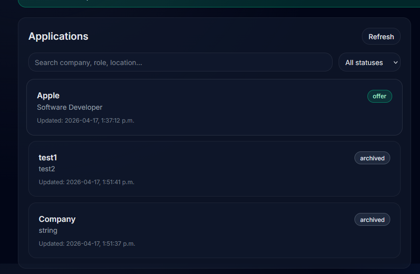

# LLM Job Tracker

AI-powered job application tracker with automated note generation.

Track job applications, monitor pipeline status, and generate tailored insights like "Why I Fit", recruiter messages, and interview checklists using LLMs.

---

## Features

- Track job applications with status (applied, interviewing, offer)
- Dashboard with pipeline stats
- Search and filter applications
- Detailed application view
- AI-generated:
  - Why I Fit
  - Recruiter message
  - Interview checklist
- Background processing with Celery + Redis
- Local LLM support via Ollama

---

## Tech Stack

- Backend: FastAPI, Python
- Database: MongoDB
- Async Tasks: Celery, Redis
- Frontend: Next.js, TypeScript, TailwindCSS
- AI: Ollama, LLM

---

## Screenshots

Focused UI crops (not full-page captures) so text and controls stay readable on GitHub.

### Dashboard Overview

Overview of application tracking, pipeline stats, and creation flow.

<p align="center">
  
</p>

### Notes Generation (Before)

Selected application before AI-generated notes are created.

<p align="center">
  
</p>

### Notes Generation (After)

Selected application after AI-generated notes are created.

<p align="center">
  
</p>

---

## Architecture

Frontend (Next.js) -> FastAPI -> MongoDB  
FastAPI -> Celery + Redis -> Ollama (LLM)

---

## Running Locally

### 1. Clone the repository

```bash
git clone https://github.com/onurozko/LLM-Job-Tracker-API.git
cd LLM-Job-Tracker-API
```

### 2. Start services

```bash
docker compose up --build
```

### 3. Access

- **Frontend:** http://localhost:3000
- **API docs:** http://localhost:8000/docs

From `frontend/`, run `npm install` then `npm run dev` (use `frontend/.env.example` as `frontend/.env.local`). Copy root `.env.example` to `.env` before Docker; set `CORS_ORIGINS=http://localhost:3000` for the dashboard.
